# Physician App

Ứng dụng này sử dụng trong công việc khám chữa bệnh của bác sĩ.

## Tính năng chính

- **Quản lý tài khoản**: Đăng nhập, đổi mật khẩu, quản lý thông tin cá nhân.
- **Quản lý lịch làm việc**: Xem, thêm, chỉnh sửa lịch của bác sĩ.
- **Chức năng theo vai trò**:
    - **Bác sĩ điều trị (Attending Physician)**: Tạo bệnh án, khám bệnh, chỉ định dịch vụ, xem hồ sơ bệnh án.
    - **Bác sĩ xét nghiệm (Lab Physician)**: Lấy mẫu, nhập kết quả xét nghiệm.
    - **Bác sĩ chẩn đoán hình ảnh (Imaging Physician)**: Thực hiện kỹ thuật, nhập kết quả hình ảnh.

## Cấu trúc thư mục kiểu feature-based architecture (tổ chức theo tính năng)

```aiignore
src/
├── features/
│   ├── auth/                       # Đăng nhập / đăng xuất
│   ├── medical-records/           # Tạo và xem bệnh án điện tử
│   ├── diagnosis/                 # Chuẩn đoán sơ bộ, lâm sàng, xác định, kê đơn thuốc 
│		│   ├── components/          # Các UI component dùng trong tính năng này
│		│   │   └── DiagnosisForm.tsx
│		│   ├── pages/               # Các trang giao diện (mỗi trang tương ứng 1 route)
│		│   │   ├── IndexPage.tsx
│		│   │   └── DetailPage.tsx
│		│   ├── hooks/               # Các custom hooks nội bộ
│		│   │   └── useDiagnosisForm.ts
│		│   ├── services/            # Gọi API riêng cho tính năng này (wrapper từ lib/api nếu cần)
│		│   │   └── diagnosisService.ts
│		│   ├── schemas/             # Zod/Yup schema cho validate form
│		│   │   └── diagnosisSchema.ts
│		│   ├── types/             # Interface/type riêng cho diagnosis
│		│   └── index.ts             # File barrel (export các component/hook/service để import gọn)
│   ├── services/                  # Chỉ định dịch vụ
│   ├── lab/                       # Nhập kết quả xét nghiệm
│   ├── imaging/                   # Nhập kết quả hình ảnh (bác sĩ chụp chiếu)
│   ├── finance/                   # Thanh toán
│   ├── reports/                   # Báo cáo thống kê
│   └── schedule/                  # Xem lịch làm việc
├── api/                           # Config API dùng chung
├── components/                    # UI dùng lại
├── hooks/                         # Chứa các hàm bắt đầu bằng use... giúp tái sử dụng logic 
├── lib/                       # Logic hệ thống, tiện ích, cấu hình
│   ├── api/                   # Các API gọi backend
│   │   ├── http.ts            # Cấu hình axios
│   │   ├── patientApi.ts
│   │   └── authApi.ts
│   ├── utils/                 # Hàm tiện ích (date, string,...)
│   │   ├── date.ts
│   │   └── string.ts
│   └── config.ts              # ENV, BASE_URL,...
├── constants/                 # Các hằng số hệ thống
├── routes/                   # Sinh ra các đường dẫn được phép truy cập theo từng role
├── providers/               # Các Provider sd để quản lý trạng thái toàn app
├── stores/                        # Zustand/Redux store
└── app.tsx
```

## Rule code

- Code chia theo các features với ý nghĩa như sơ đồ trên
- Để gọi API:
    - Cần code hook để gọi API riêng cho từng tính năng (sử dụng lại hookApi chung trong src/hooks)
    - Kiểu dữ liệu nhận/gửi khai báo trong /types của từng tính năng
- Xử lý lỗi/loading:
    - Xử lý lỗi trong hook
    - Xử lý loading ở UI

## Usecase tổng quan


## Sơ đồ lớp


## CSDL trên server


## Sơ đồ triển khai

| Sơ đồ triển khai chung                                                     | Sơ đồ triển khai chi tiết cho HIS                                   |
|----------------------------------------------------------------------------|---------------------------------------------------------------------|
|  |  | 

## Kết quả sau khi chạy

|                                 |                                 |
|---------------------------------|---------------------------------|
| 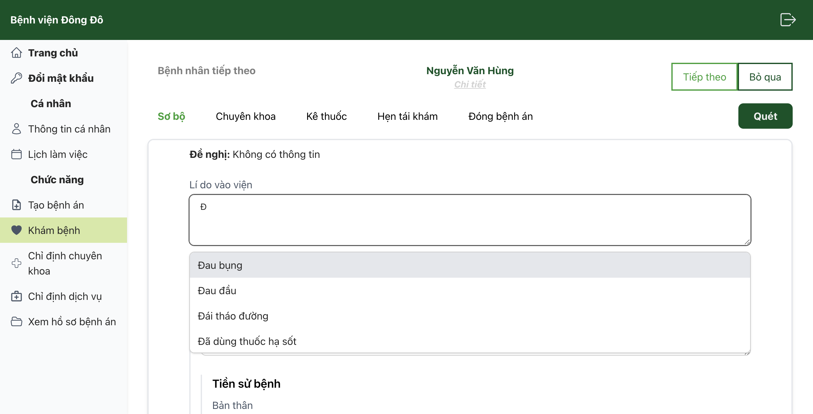   | 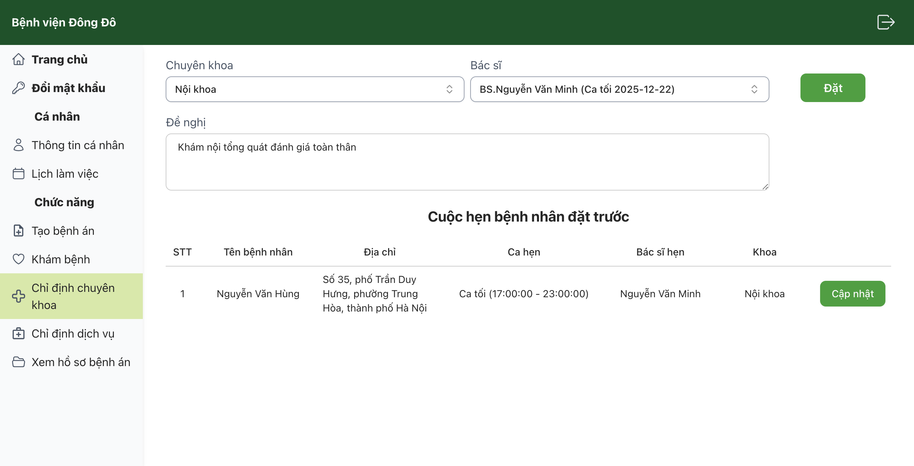   |
| 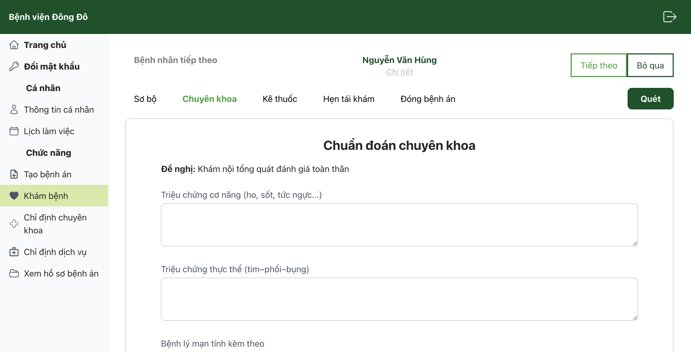   | 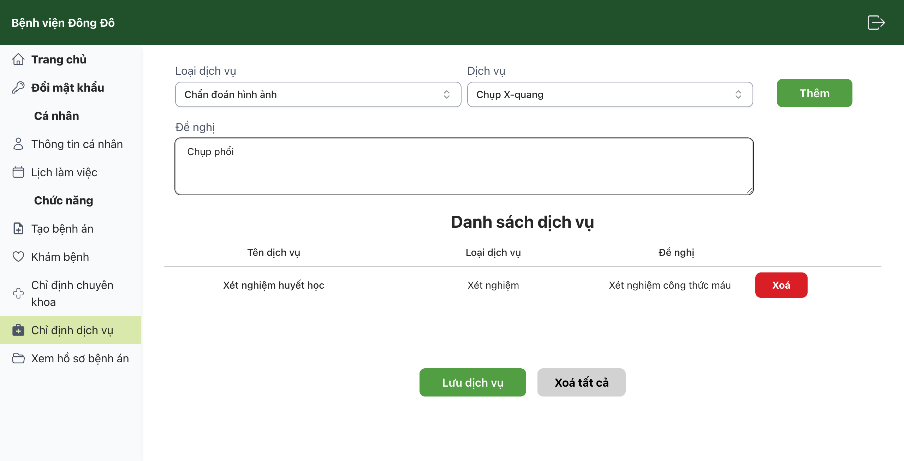   |
| 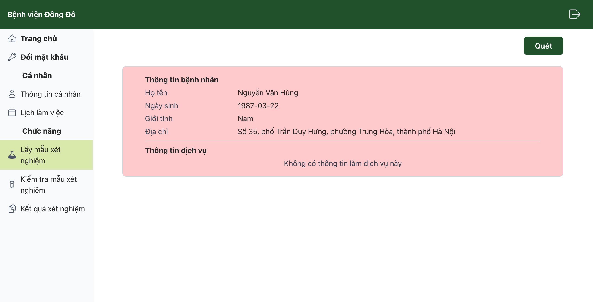   | 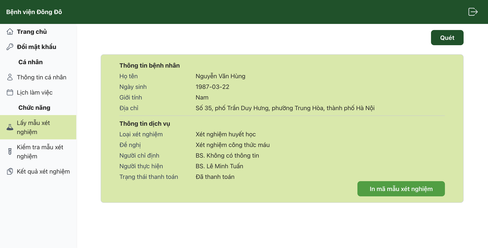   |
| 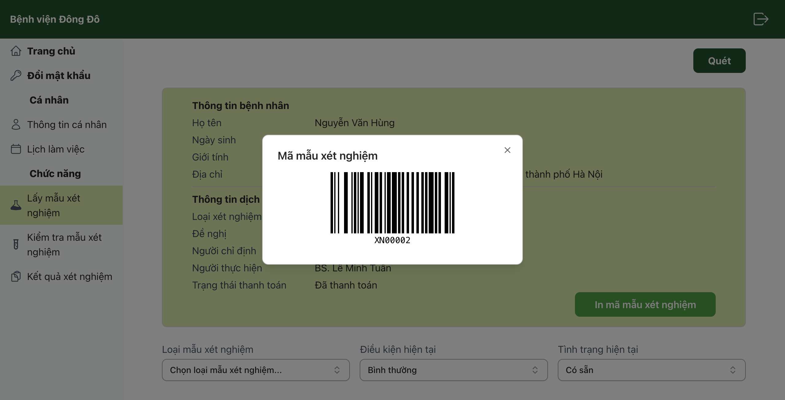   | 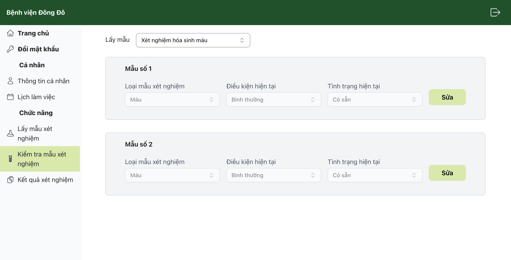   |
| 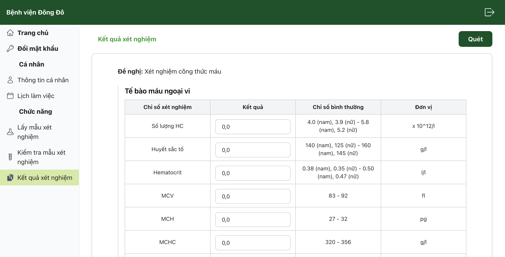   |  |
| 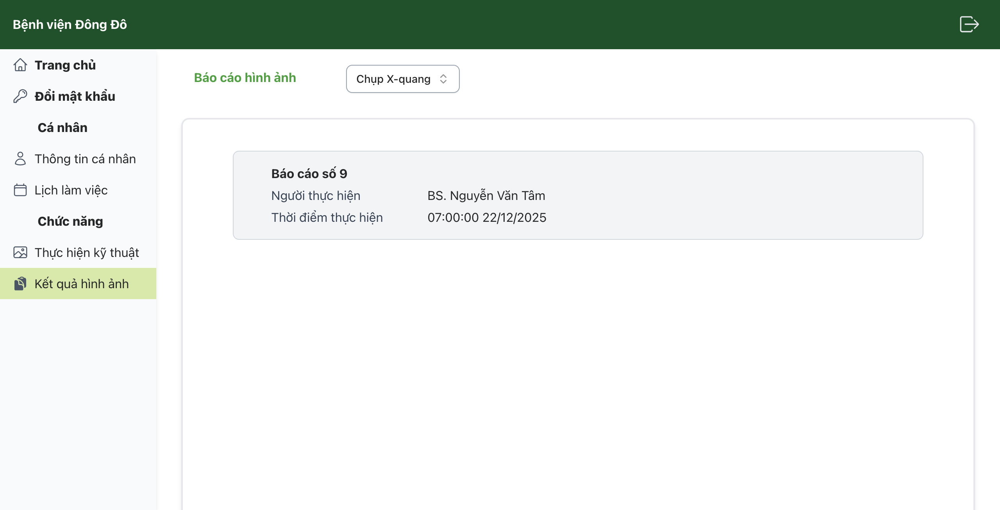 | 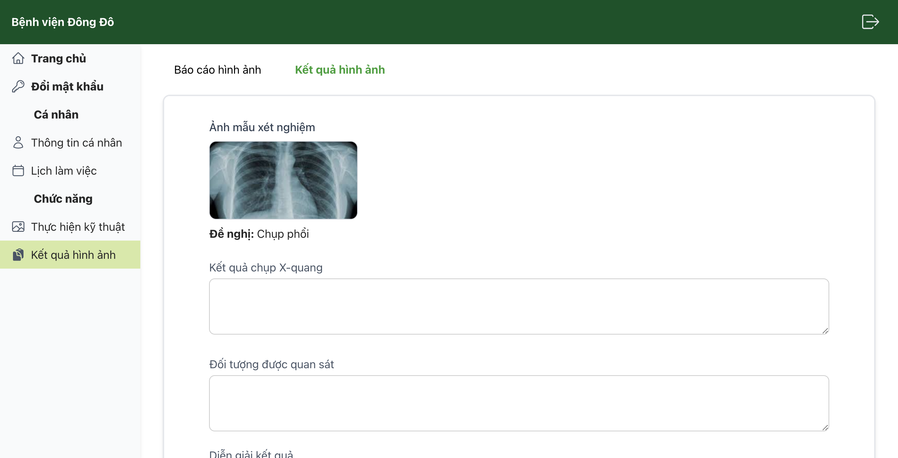 |
| 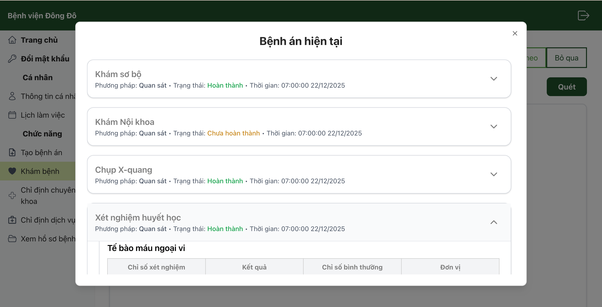 | 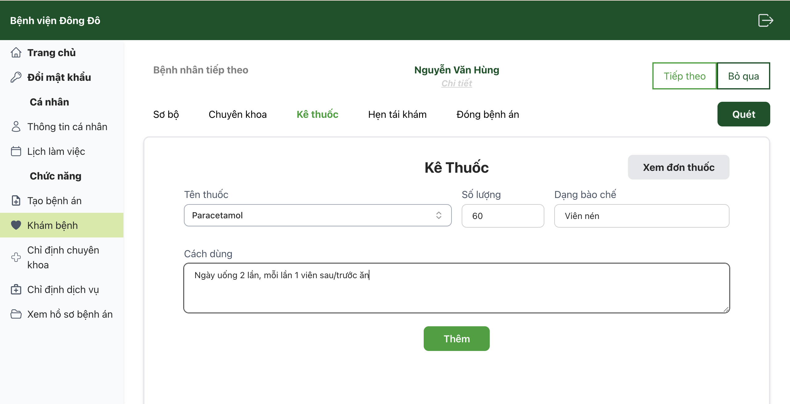 |
| 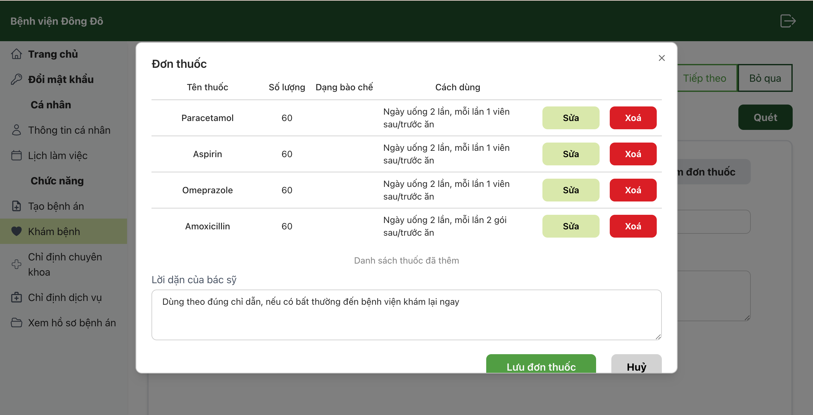 | 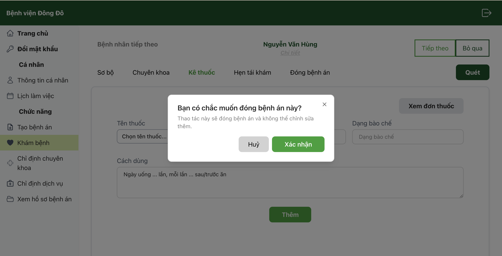 |
| 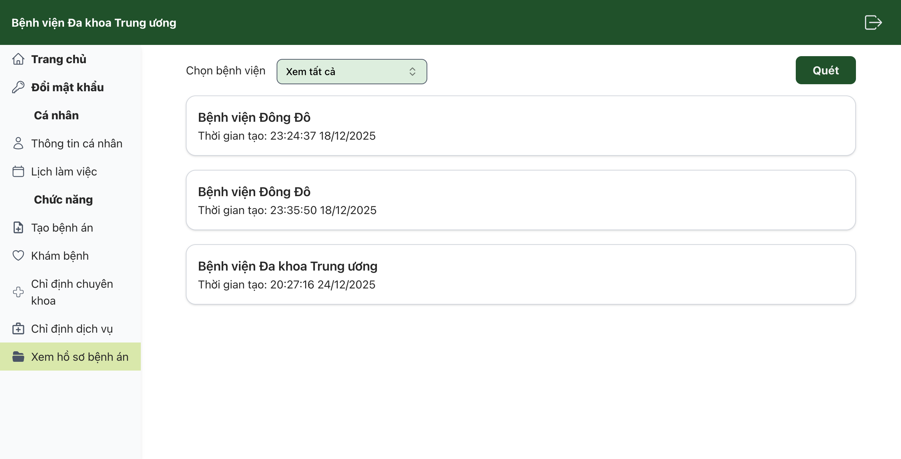 | 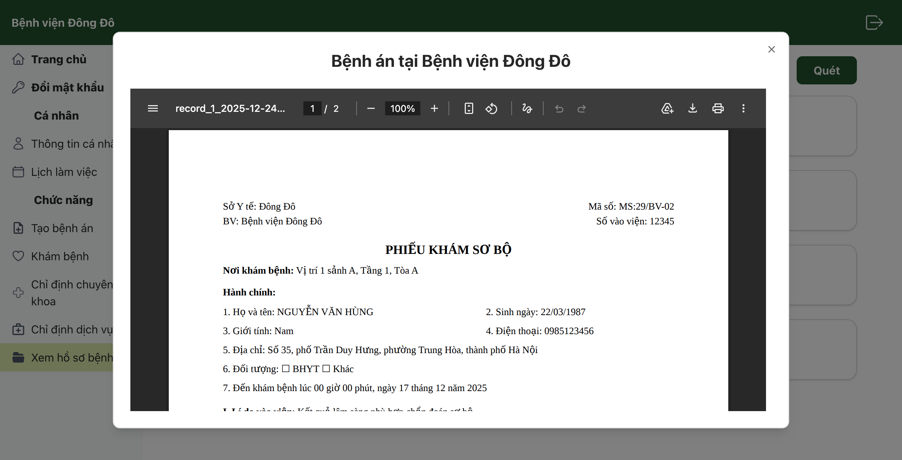 |

---

## Cài đặt & chạy dự án

1. Clone repo

```bash
git clone https://github.com/chuthimai/physician_app_DATN.git
```

2. Cài dependencies

```bash
npm install
```

3. Tạo file môi trường

   Cập nhật các giá trị trong .env:

```text
VITE_API_BASE_URL=...
VITE_NODE_ENV=development
```

4. Chạy dự án

```bash
npm run dev
```

5. Build production

```bash
npm run build
```